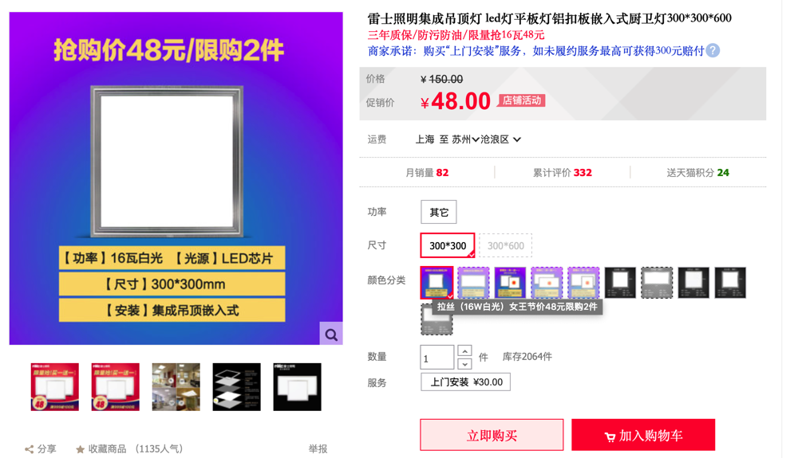
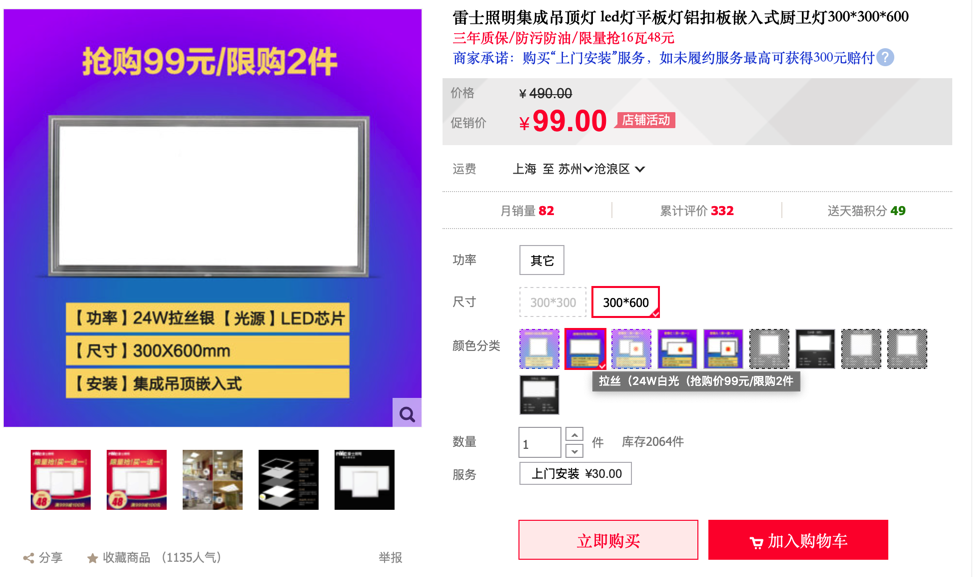

# 卫生间

## 集成吊顶

### LED灯

集成吊顶用的灯常见有2种：

* `方灯`=`正方形`的 `300mm * 300mm` 的LED灯
  * 比如：
    * 
* `长灯`=`长方形`的 `300mm * 600mm` 的LED灯
  * 比如：
    * 

尺寸都是统一的 -》 所以如果坏了，可以自己去网上购买，比如：

[雷士照明集成吊顶灯 led灯平板灯铝扣板嵌入式厨卫灯300*300*600-tmall.com天猫](https://detail.tmall.com/item.htm?id=25543664486)

然后自己即可安装。

安装时，找个小吸盘，吸住吊顶的单片金属方板的边角，即可拉下来，然后即可取下方板，然后自己断点，换上新LED灯，即可。