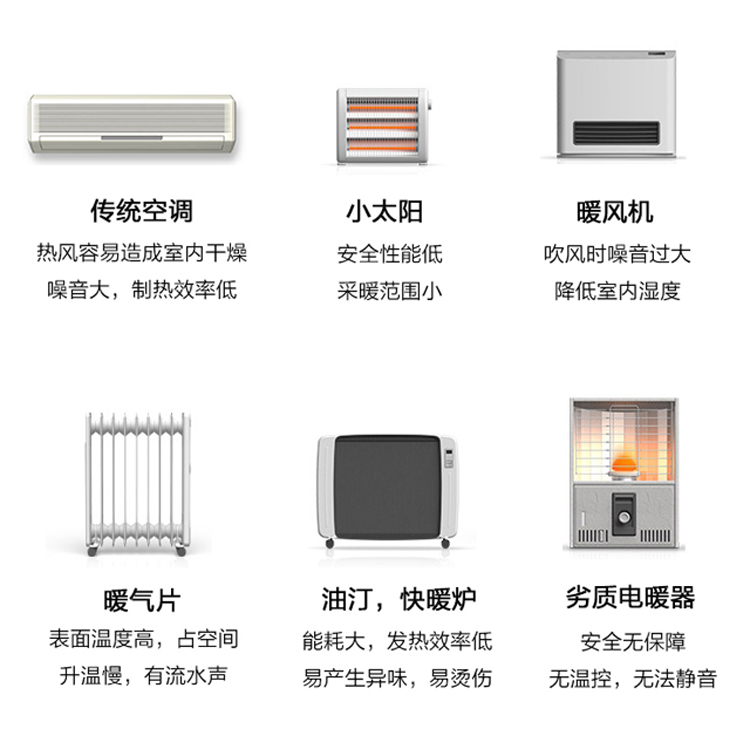
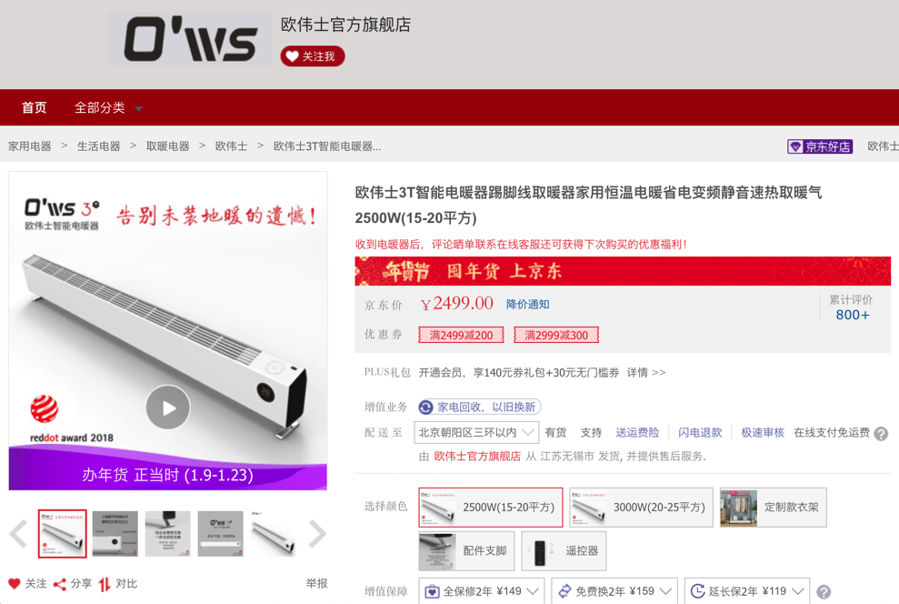
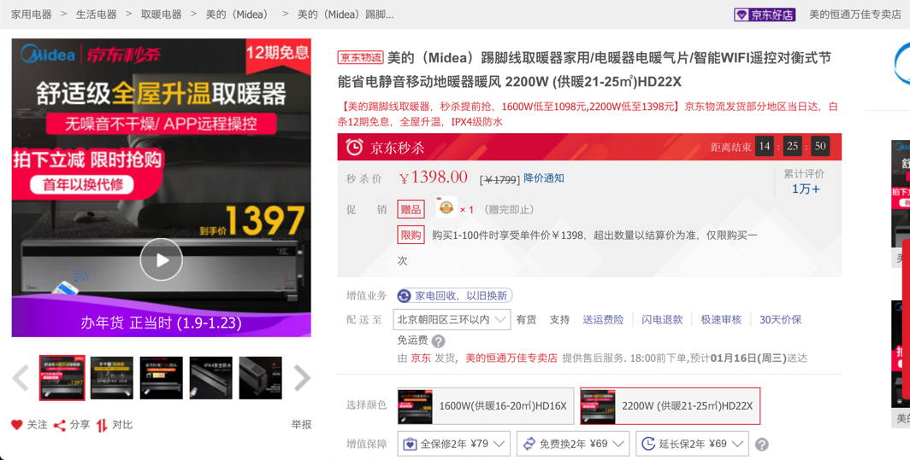

# 取暖

最近的取暖科技新推出了`踢脚线取暖器`，价格稍贵，但是效果很好，可媲美地暖。

和空调相对最大优势是：`不干燥`。

贴出其和之前各种取暖设备的优势对比：

有需要的可以考虑如入手常见的2款，对比如下：

* 欧伟士3T，2500W，15-20平方，价格：`2499`
  * 优势
    * 更美观
    * 更专业：凌控的温控
    * 升温（好像）更快：半小时就提升5度
  * 购买地址：
    * [欧伟士3T智能电暖器踢脚线取暖器家用恒温电暖省电变频静音速热取暖气 2500W(15-20平方)【图片 价格 品牌 报价】-京东](https://item.jd.com/33231842388.html)
  * 截图：
    * 
* 美的Midea HD22X，2200W，供暖21-25㎡，价格：`1398`
  * 优势
    * 细节更实用：左边槽位可以放遥控器
    * 能耗比低：同样覆盖20平米，功率更低
    * 长度小：`1106 * 132 * 236` -》只有1.1米长
        * 欧伟士：`1500 * 90 * 170mm` -》要1米5长
    * 性价比高：价格更实惠
  * 购买地址：
    * [美的（Midea）踢脚线取暖器家用/电暖器电暖气片/智能WIFI遥控对衡式节能省电静音移动地暖器暖风 2200W (供暖21-25㎡)HD22X【图片 价格 品牌 报价】-京东](https://item.jd.com/32167147566.html)
  * 截图：
      * * 

详见：

* 【整理】踢脚线取暖器 可移动地暖
